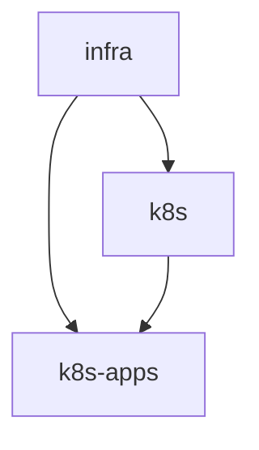

# Infrastructure as Code (IaC) for Google Cloud (GCP) — GKE-focused

This repository provisions and composes Google Cloud infrastructure (networking, GKE clusters, Helm-managed applications, and secrets) using Terraform. The layout splits functional layers into separate root modules so each stack has its own remote state and can be planned/applied independently.

High-level intent: keep stacks small and composable, publish outputs from upstream stacks via Terraform outputs and consume them via `data "terraform_remote_state"` in downstream stacks.

---

## High-Level Stack Overview

Top-level stack directories (example `dev` environment):

- `dev/infra/` — Core networking, VPC, subnets, project/region context
- `dev/k8s/` — GKE cluster, node pools, cluster-level providers and bootstrap resources
- `dev/k8s-apps/` — Helm / Kubernetes resources (ArgoCD, AppSets, gateway charts)
- `dev/common/` — shared provider pinning or helper fragments used by the roots
- `modules/` — reusable Terraform modules consumed by the root stacks

This separation lets you run `terraform plan`/`apply` selectively (for example only `infra`, or only `k8s-apps`).

Mermaid graph (conceptual cross-stack dependencies):



Apply order (topological): `infra → k8s → k8s-apps` (apply `infra` first so other stacks can consume outputs).

---

## State & Backend Strategy

This project stores Terraform state files in a single GCS bucket. Each stack uses a distinct prefix to isolate state.

Conventions observed in this repo:

- Bucket: `adt-terraform-state-buckets`
- Key / prefix layout: `gke/clusters/<env>/<stack>`

Example backend block (used in `dev/*/backends.tf`):

```hcl
terraform {
  backend "gcs" {
    bucket = "adt-terraform-state-buckets"
    prefix = "gke/clusters/dev/k8s"
  }
}
```

Notes:
- Keep a single bucket and logical prefixes per stack. This makes cross-stack consumption straightforward via `data "terraform_remote_state"`.
- When renaming or moving state keys, use `gsutil` or the Cloud Console to copy/rename objects and update the backend configuration accordingly.

---

## Cross-Stack Outputs and Remote State

Upstream stacks should export values you expect downstream stacks to consume via `outputs.tf`. Downstream stacks consume them like this:

```hcl
data "terraform_remote_state" "infra" {
  backend = "gcs"
  config = {
    bucket = "adt-terraform-state-buckets"
    prefix = "gke/clusters/dev/infra"
  }
}

# then use data.terraform_remote_state.infra.outputs.some_value
```

Avoid duplicating or re-deriving values that are already exported from another stack. If something is an upstream artifact (project ID, cluster endpoint, CA cert), export it and consume it via remote state.

---

## Provider & Authentication Patterns

This repository uses the Google provider to interact with GCP and then configures the Kubernetes/Helm providers dynamically using GKE cluster information.

Recommended pattern used in the repo (safe for CI and non-interactive applies):

- Use `data "google_container_cluster"` to fetch the cluster endpoint and `master_auth`.
- Use `data "google_client_config"` to obtain an access token (or use a service account key injected in the environment/CI).
- Configure the `kubernetes` provider with `host`, `token`, and `cluster_ca_certificate` and `load_config_file = false`.
- Configure the `helm` provider to use the same cluster settings (or rely on the `kubernetes` provider if preferred).

Example provider fragment (pattern used in `dev/k8s/providers.tf` or `dev/k8s-apps/providers.tf`):

```hcl
data "google_container_cluster" "gke" {
  name     = var.cluster_name
  location = var.location
}

data "google_client_config" "current" {}

provider "kubernetes" {
  host                   = "https://${data.google_container_cluster.gke.endpoint}"
  token                  = data.google_client_config.current.access_token
  cluster_ca_certificate = base64decode(data.google_container_cluster.gke.master_auth.0.cluster_ca_certificate)
  load_config_file       = false
}

provider "helm" {
  kubernetes {
    host                   = "https://${data.google_container_cluster.gke.endpoint}"
    token                  = data.google_client_config.current.access_token
    cluster_ca_certificate = base64decode(data.google_container_cluster.gke.master_auth.0.cluster_ca_certificate)
  }
}
```

Why this approach?
- It avoids depending on a local kubeconfig file or KUBECONFIG env var in CI.
- Providers are configured from Terraform data sources and will work in non-interactive environments when the Google provider has credentials (ADC, service account, etc.).

---

## Common Gotchas (and fixes)

- Variables not allowed in `terraform.tfvars`
  - Cause: `terraform.tfvars` must contain literal values (strings, numbers, lists, maps). Expressions like `data.terraform_remote_state.*` are not allowed inside `*.tfvars`.
  - Fix: Move expressions into HCL configuration (e.g., `main.tf`) and use `data "terraform_remote_state"` there. Keep `*.tfvars` as a map of literal inputs.

- `Kubernetes cluster unreachable: invalid configuration` / Helm install errors
  - Cause: `kubernetes` and/or `helm` provider is not configured (Terraform falls back to localhost causing `http://localhost:80` attempts).
  - Fix: Configure `kubernetes` (and `helm`) providers using the GKE data sources as shown above. Ensure the provider blocks are in the same working directory as the module that creates resources needing those providers, or explicitly pass provider configurations into modules if using multiple workspaces.

- Helm release fails with `ApplicationSet... metadata.name: Invalid value: "${var.appset_name}"`
  - Cause: Unrendered Terraform interpolation (literal `${var.something}`) ended up in YAML sent to the chart. Charts treat that as an invalid Kubernetes name.
  - Fix: Use `templatefile()` in Terraform to render values.yaml with a map of variables, or ensure `values.yaml` uses a templating convention that Terraform processes before passing to Helm. Also validate variable `appset_name` using a regex for RFC1123 subdomain if needed.

- Remote state prefix mismatch
  - Cause: Wrong `prefix` or `key` in `backends.tf` / `data.terraform_remote_state` leads to missing outputs.
  - Fix: Verify the exact prefix/key used in the upstream stack's backend block and match it in the downstream `data` block.

---

## Working with Stacks (quick commands)

Bootstrap and init the GCS state bucket (one-time):

```bash
./init.sh    # creates/enables versioning on the GCS bucket used for terraform state (if present)
```

Typical workflow for a stack (example `dev/infra`):

```bash
cd dev/infra
terraform init
terraform plan -out=plan.out
terraform apply plan.out
```

Then provision cluster and apps:

```bash
cd ../k8s
terraform init
terraform apply -auto-approve

cd ../k8s-apps
terraform init
terraform apply -auto-approve
```

Notes:
- Always apply `infra` before `k8s`; apply `k8s` before `k8s-apps` because downstream stacks read outputs from upstream remote state.
- For CI, prefer non-interactive `terraform init -input=false` and `terraform apply -auto-approve` and ensure service account credentials are available to the Google provider.

---

## Helm / AppSet / values.yaml Guidance

- If you manage Helm values that need Terraform variables, render them with `templatefile()` so Terraform interpolates the values before handing them to Helm.
- Keep `values.yaml` in the module but use `${varname}` placeholders and call `templatefile(path, { varname = var.value })` from the `helm_release` resource.
- Validate Kubernetes resource names (AppSets, Secrets) against RFC1123 rules — Terraform can validate input variables using `validation {}` blocks.

Example using `templatefile()` in `helm_release`:

```hcl
values = [templatefile("${path.module}/values.yaml", {
  appset_name = var.appset_name
  github_org  = var.github_org
  chart_repo  = var.chart_repo
  chart_name  = var.chart_name
  chart_version = var.chart_version
})]
```

---

## Security & Access

- State bucket should have appropriate IAM controls (least privilege) and versioning enabled so you can recover previous state.
- Use a dedicated service account for CI with scoped permissions (GKE, Secret Manager, Storage) and supply credentials through CI secrets or Workload Identity where possible.
- Avoid storing secrets in plaintext in `*.tfvars`. Use Secret Manager or Vault + `google_secret_manager_secret_version` as seen in the modules.

---

## Troubleshooting Quick Reference

| Symptom | Quick diagnostic | Typical fix |
|---|---:|---|
| `Variables not allowed` error when reading tfvars | Inspect your `*.tfvars` for expressions like `data.*` | Move expressions into `*.tf` and keep tfvars literals |
| Helm/Kubernetes resources targeting `localhost` | Check `kubernetes` provider block / `host` value | Configure provider with GKE endpoint and token (data.google_container_cluster / data.google_client_config) |
| Missing remote outputs | `terraform state list` or `terraform output -state=...` on upstream | Ensure `data.terraform_remote_state` matches the upstream `prefix`/`key` |

---

## Module Sourcing & Versioning

Where Git modules are used, pin with `?ref=` (tag/commit) to ensure reproducible module versions:

```hcl
module "k8s_module" {
  source = "git::https://github.com/mdefenders/terraform-gcp-k8s.git?ref=v1.2.0"
}
```

---

## Adding a New Stack

1. Copy a minimal skeleton from an existing stack (`backends.tf`, `providers.tf`, `variables.tf`, `outputs.tf`).
2. Choose a unique GCS prefix: `gke/clusters/<env>/<new-stack>`.
3. If downstream stacks need values, expose them in `outputs.tf` and document the outputs.

---

## License

MIT

---

If you'd like, I can also:
- Add a `README.dev.md` per stack containing stack-specific examples and required secrets/variables.
- Create `terraform.tfvars.example` files for each stack showing required inputs (without secrets).
- Add GitHub Actions / CI snippets for non-interactive applies with service account credentials.
